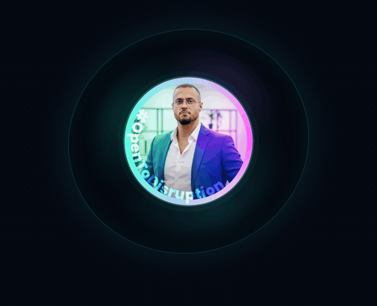
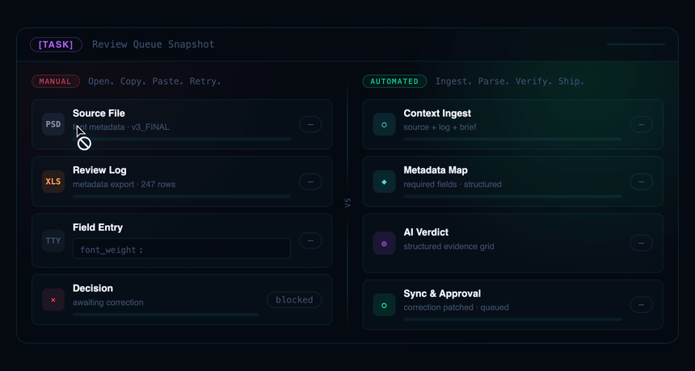
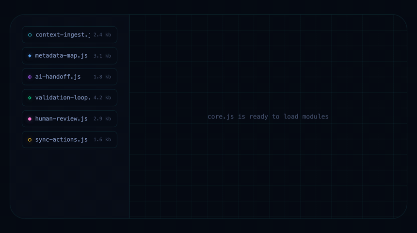
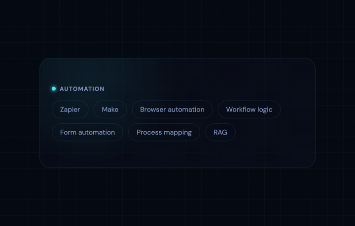

# The anatomy of pietro.works

A design record of [pietro.works](https://pietro.works/), taken apart piece by piece. The site is a single-page portfolio built like the private tools it describes: near-black navy glass, one luminous accent spectrum, monospace readouts, and motion that only moves when it has something to say. This repo isolates the constructions that make it feel that way, and runs each one live.

**[Open the showcase →](https://pietro-works.github.io/PietroWorks/)**

Everything here runs on production values. The CSS on each stage is lifted from the live stylesheet, not approximated, so what you inspect is what actually ships.

## The six stages

Four of them, captured in motion below.

### 03 · The orbit

The "How I work" section's signature scene: a still portrait while three signal chips fly in and boot up, an orchestration meter charges, and the whole apparatus bursts away and rebuilds. Pure CSS, one shared 9.6 second clock, no JavaScript.



### 04 · The review queue

The Architecture section's proof-by-demonstration: the same task run twice, side by side. On the left, a person copies a value, mistypes it, and the row goes red. On the right, four pipeline stages ingest, map, verify and sync, and an approval stamp lands. Both lanes replay on a shared 7.5 second clock, driven by one synthetic cursor.



### 05 · The module board

The Reliability section's build loop: a ghost cursor picks files off a shelf, places each one as a glowing node, wires them in sequence, taps the finished cluster, and clears the canvas to do it again.



### 06 · The flip

The Toolkit section's dual-audience card: named tools on the front for the person evaluating stacks, plain outcomes on the back for the person who signs off. One 720ms rotation between them.



### 01 · The gradient accent, 02 · Interface atoms

The other two stages don't animate on a loop, so they're better felt live than watched as a GIF: [the two-layer gradient accent](https://pietro-works.github.io/PietroWorks/stages/01-accent.html) exploded into its parts with a bloom toggle, and [the interface atoms](https://pietro-works.github.io/PietroWorks/stages/02-atoms.html) — eyebrows, buttons, badges, chips — each on its own pedestal with live hover states.

## What's on the hub page

The [index](https://pietro-works.github.io/PietroWorks/) reads the whole site closely before sending you to a stage: three principles behind the voice, six details that surface copies always miss, a section-by-section pass over all eleven bands of the live page, and a colophon with the full token palette.

Every stage ends in a specimen ledger: exact timings, easings, and values, so the numbers are checkable rather than implied.

## Viewing locally

Static files, no build step.

```
git clone git@github.com:pietro-works/PietroWorks.git
cd PietroWorks
python3 -m http.server 8000
```

Then visit `http://localhost:8000/`. Fonts load from Fontshare and Google Fonts, so the first view wants a network connection.

## Structure

```
index.html             the hub: voice, fingerprint, anatomy, colophon
shared.css              tokens and stage chrome
stages/
  01-accent.html         the two-layer gradient accent
  02-atoms.html           the smallest parts, live
  03-orbit.html           the How I work animation, isolated
  04-review-queue.html    the Architecture split demo, isolated
  05-modules.html         the Reliability build loop, isolated
  06-flip.html            the toolkit flip card, live
assets/                 portrait, pointer, cursor assets used by the stages
.github/readme-media/   the four GIFs above, for this file only
```

## Status

Current with the live site as of July 2026. When the site moves, the stages should move with it; the ledgers make drift easy to spot.

Design and photography belong to Pietro Impagliazzo. If you borrow the techniques, the two-layer accent and the tinted hairlines travel well. The voice stays here.
